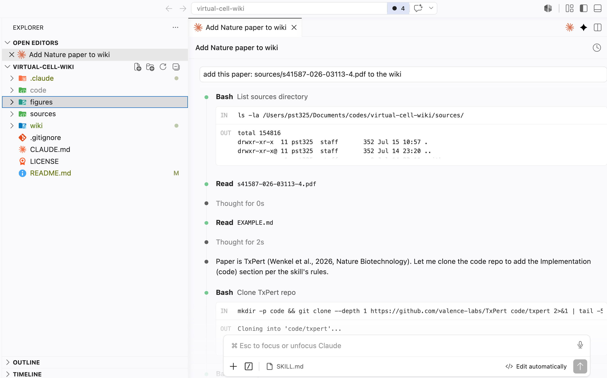
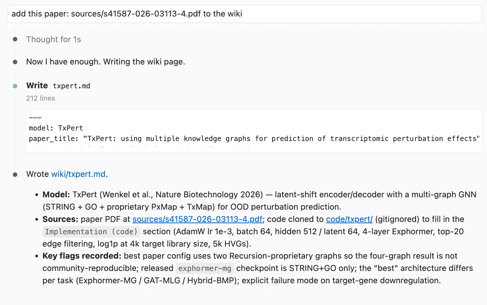

<p align="center">
  
</p>

# Virtual cell wiki

A self-maintaining wiki of virtual cell model papers. One page per model. Ships with a seed set of processed pages, and lets you add your own papers with the bundled Claude Code skill.

## Included pages

| Model                                                   | Title                                                                                                                                                               | Core idea                                                                                                                  |
| ------------------------------------------------------- | ------------------------------------------------------------------------------------------------------------------------------------------------------------------- | -------------------------------------------------------------------------------------------------------------------------- |
| [CellFlow](wiki/cellflow.md)                             | [CellFlow enables generative single-cell phenotype modeling with flow matching](https://doi.org/10.1101/2025.04.11.648220)                                           | Conditional flow matching + optimal transport across cytokines, drugs, knockouts, morphogens                               |
| [GEARS](wiki/gears.md)                                   | [Predicting transcriptional outcomes of novel multigene perturbations with GEARS](https://doi.org/10.1038/s41587-023-01905-6)                                        | GNN over gene coexpression + GO graph for unseen single/combo CRISPR perturbations                                         |
| [GenBio-FM-Perturbation](wiki/genbio-fm-perturbation.md) | [Foundation Models Improve Perturbation Response Prediction](https://www.biorxiv.org/content/10.64898/2026.02.18.706454v1)                                           | Benchmark of >600 FM embeddings plus an attention-fusion model for perturbation prediction                                 |
| [MORPH](wiki/morph.md)                                   | [MORPH Predicts the Single-Cell Outcome of Genetic Perturbations Across Conditions and Data Modalities](https://www.biorxiv.org/content/10.1101/2025.06.27.661992v1) | cVAE with cross-attention over learned gene programs, unpaired MMD training                                                |
| [scDiffusion](wiki/scdiffusion.md)                       | [scDiffusion: conditional generation of high-quality single-cell data using diffusion model](https://doi.org/10.1093/bioinformatics/btae518)                         | Latent DDPM in a foundation-model latent space with multi-classifier guidance for conditional scRNA generation             |
| [scDiffusion-X](wiki/scdiffusion-x.md)                   | [A multi-modal diffusion model with dual-cross-attention for multi-omics data generation and translation](https://doi.org/10.1038/s41467-026-71744-x)                | Multi-omics latent diffusion with Dual-Cross-Attention between RNA and ATAC for generation, translation, and GRN inference |
| [scFoundation](wiki/scfoundation.md)                     | [Large-scale foundation model on single-cell transcriptomics](https://doi.org/10.1038/s41592-024-02305-7)                                                            | 100M-param asymmetric encoder-decoder pretrained on 50M cells with read-depth-aware masked regression                      |
| [scGPT](wiki/scgpt.md)                                   | [scGPT: toward building a foundation model for single-cell multi-omics using generative AI](https://doi.org/10.1038/s41592-024-02201-0)                              | Transformer FM on 33M cells with generative gene-expression pretraining, fine-tuned per downstream task                    |
| [scLAMBDA](wiki/sclambda.md)                             | [Modeling and predicting single-cell multi-gene perturbation responses with scLAMBDA](https://doi.org/10.1101/2024.12.04.626878)                                     | VAE that disentangles basal state from a GenePT perturbation embedding, MI + FGSM regularization                           |
| [scPerturBench](wiki/scperturbench.md)                   | [Benchmarking algorithms for generalizable single-cell perturbation response prediction](https://doi.org/10.1038/s41592-025-02980-0)                                 | Benchmark of 27 perturbation-prediction methods across 29 datasets under unified splits and metrics                        |
| [State](wiki/state.md)                                   | [Predicting cellular responses to perturbation across diverse contexts with State](https://doi.org/10.1101/2025.06.26.661135)                                        | Set-level transformer trained with MMD to map control-cell sets to perturbed-cell sets                                     |
| [TranscriptFormer](wiki/transcriptformer.md)             | [TranscriptFormer: A generative cell atlas across 1.5 billion years of evolution](https://doi.org/10.1126/science.aec8514)                                           | Autoregressive FM using ESM-2 protein embeddings as gene tokens; species-agnostic across 12 organisms                      |
| [TxPert](wiki/txpert.md)                                 | [TxPert: using multiple knowledge graphs for prediction of transcriptomic perturbation effects](https://doi.org/10.1038/s41587-026-03113-4)                          | Latent-shift decoder + attention GNN over multiple gene-gene knowledge graphs (STRING, GO, PxMap, TxMap)                   |
| [X-Cell](wiki/x-cell.md)                                 | [X-Cell: Scaling Causal Perturbation Prediction Across Diverse Cellular Contexts via Diffusion Language Models](https://doi.org/10.64898/2026.03.18.712807)          | Set-level masked-diffusion transformer with multimodal priors via cross-attention, scaled to 4.9B parameters               |

## Install

Requires [Claude Code](https://docs.claude.com/en/docs/claude-code/overview). For large PDF files, install tools like [poppler](https://formulae.brew.sh/formula/poppler)

```bash
git clone https://github.com/deweihu96/virtual-cell-wiki
cd virtual-cell-wiki
claude            # start Claude Code in the repo root
```

The extraction skill is project-scoped (`.claude/skills/virtual-cell-wiki/`) and activates
automatically. There is nothing else to install: the skill and the content directory travel together in this repository.

## Use

- Browse existing pages in `wiki/`.
- Add a paper — any of:
  - drop a PDF into `sources/` and say "add this to the wiki";
  - paste an arxiv link (`https://arxiv.org/abs/...`);
  - paste a bioRxiv link (`https://www.biorxiv.org/content/...`) — Claude fetches the PDF into `sources/` for you.
- If the skill does not trigger on its own, invoke it directly with `/virtual-cell-wiki`.

Run Claude Code from the repository root so `wiki/` and the skill are both in reach.

### Example

Drop the paper in `sources/` and ask Claude to add it. The skill reads the PDF, consults
the schema in `EXAMPLE.md`, and (if a code repo is linked) clones it into `code/` to fill
in the `Implementation (code)` section:



The result is a single Markdown page in `wiki/` with YAML frontmatter and the standard
sections (paper vs. code implementation, evaluation, author claims, limitations):



## Deepening a page from the reference code

Papers routinely omit hyperparameters and layer specifics. When the paper links a code
repo, ask Claude to "pull implementation details from the code". Claude clones the repo
into `code/<model>/` (gitignored), reads it, and appends an `## Implementation (code)`
section next to the existing `## Implementation (paper)` section so the paper-vs-code
delta stays visible. For small repos this is a grep pass; for large repos, Claude uses
the optional [graphify](https://github.com/Graphify-Labs/graphify) Claude Code skill (if installed) and discards the graph afterward.

## Blogs

`blogs/` holds hands-on, **non-peer-reviewed** writeups about virtual cell models and
related work — competition logs, submission postmortems, tutorials, opinion. The Arc
Virtual Cell Challenge is one common topic, not the only one. These are kept separate
from `wiki/` on purpose: blog claims are experience and opinion, not verified references.
One Markdown file per post, loose frontmatter, no fixed schema. See
[blogs/README.md](blogs/README.md).

## Sharing pages back

`wiki/` is versioned. Commit new pages and open a pull request to contribute them, or keep
your fork private. Pages are plain Markdown with YAML frontmatter, so `wiki/` also opens as
an Obsidian vault.

## Just want the extractor?

If you already have your own wiki and only want the skill, copy
`.claude/skills/virtual-cell-wiki/` into your own repo's `.claude/skills/`, or into
`~/.claude/skills/` for personal use across all projects. When installed outside this repo,
point it at your own content directory (the skill writes to a `wiki/` folder at the working
tree root by default).

## Layout

```
model-wiki/
├── CLAUDE.md                         # project context Claude Code reads automatically
├── README.md
├── .claude/
│   └── skills/
│       └── virtual-cell-wiki/
│           ├── SKILL.md              # the extraction schema and rules
│           └── references/
│               └── EXAMPLE.md        # one filled page, used for format calibration
├── wiki/                             # the knowledge base: seed pages + your pages
│   └── README.md
├── blogs/                            # non-peer-reviewed hands-on writeups
│   └── README.md
├── sources/                          # raw papers you drop in to process (optional)
│   └── README.md
└── code/                             # gitignored scratch space for cloned reference repos
```

## License

MIT.
